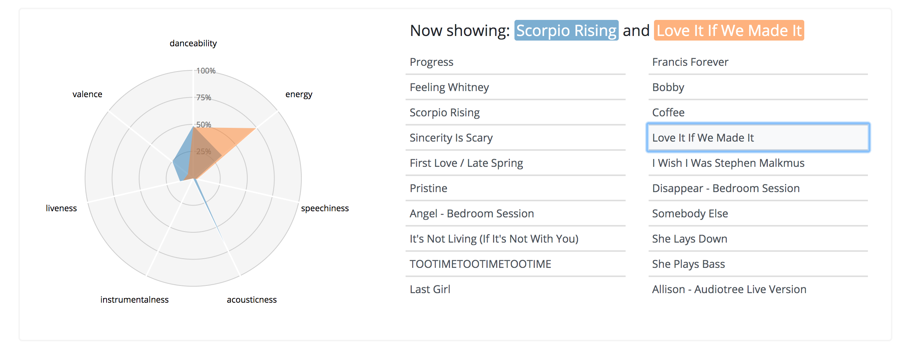
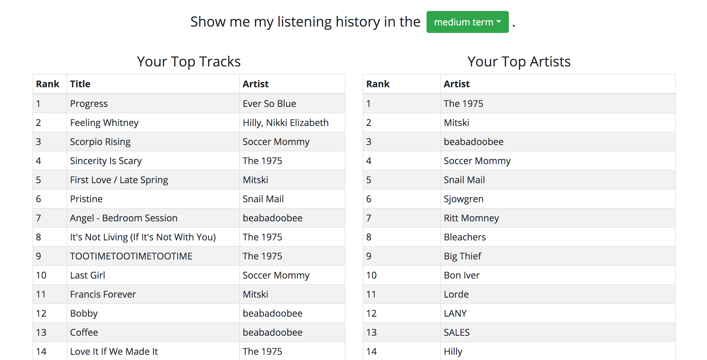

# spotify-music-dashboard
A full-stack web app template using Node, Express, React, Redux, Mongo with deployment to Heroku.

Currently, the app requires a login to use, but I have attached some screenshots of the application below:

